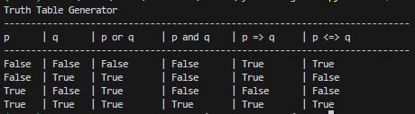
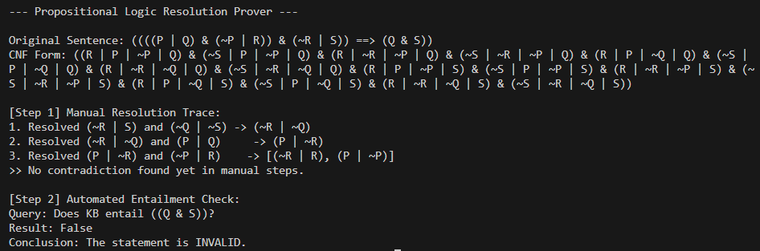
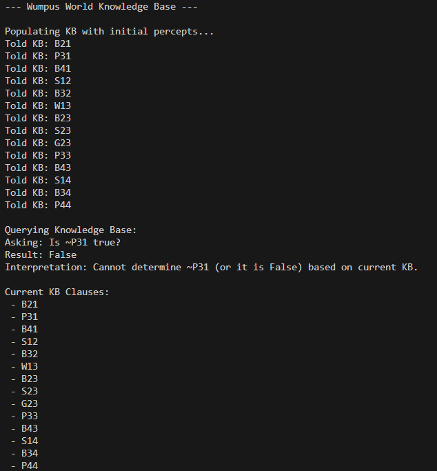
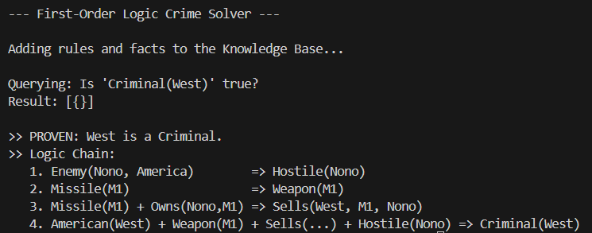

# AI Logic & Reasoning with Python

This repository contains a collection of Python scripts demonstrating fundamental Artificial Intelligence logic concepts, including Propositional Logic, First-Order Logic (FOL), Resolution Proving, and Knowledge Base agents.

These implementations utilize the **AIMA-Python** (Artificial Intelligence: A Modern Approach) library.

## 📁 Project Modules

### 1. `truth_table_generator.py`
A utility script that generates formatted truth tables for boolean logic.
* **Key Concepts:** Boolean Algebra, Logical Connectives (`AND`, `OR`, `IMPLIES`, `BICONDITIONAL`).
* **Output:** A clean table showing truth values for `p`, `q`, and their combinations.

### 2. `resolution_prover.py`
A demonstration of the Resolution inference algorithm in Propositional Logic.
* **Key Concepts:** Conjunctive Normal Form (CNF), Proof by Contradiction, Entailment.
* **Function:** Converts a complex logical sentence into CNF and proves its validity using both manual resolution steps and AIMA's automated prover.

### 3. `wumpus_world.py`
A simulation of the classic "Wumpus World" Knowledge Base.
* **Key Concepts:** Knowledge Representation, State Estimation.
* **Function:** Initializes a KB with percepts (Breeze, Stench, Pit) and allows you to query the state of the world (e.g., "Is there a pit in square [3,1]?").

### 4. `fol_crime_solver.py` 
A First-Order Logic solver for the "West is a Criminal" problem.
* **Key Concepts:** First-Order Logic (FOL), Forward Chaining, Predicates, Quantifiers.
* **Function:** Defines rules (e.g., "It is a crime for an American to sell weapons to hostile nations") and facts, then uses inference to prove that `West` is a `Criminal`.

## ⚙️ Prerequisites & Setup

These scripts require the `aima-python` utility files to run.

1.  **Download AIMA Utils:**
    Ensure you have the following files in your project directory (download them from the [official aima-python repo](https://github.com/aimacode/aima-python)):
    * `logic.py`
    * `utils.py`
    * `agents.py`

2.  **Directory Structure:**
    ```text
    /your-project-folder
    ├── utils.py
    ├── logic.py
    ├── agents.py
    ├── truth_table_generator.py
    ├── resolution_prover.py
    ├── wumpus_world.py
    └── fol_crime_solver.py
    ```

## 🚀 How to Run

Execute the scripts individually using Python 3:

```bash
# Generate Truth Tables
python truth_table_generator.py

# Run Resolution Proofs
python resolution_prover.py

# Query Wumpus World KB
python wumpus_world.py

# Solve the Crime Logic Problem
python fol_crime_solver.py
```

## Screenshots

### Truth Table Output


### Resolution Output


### Wumpus World Output


### FOL Crime Solver Output


