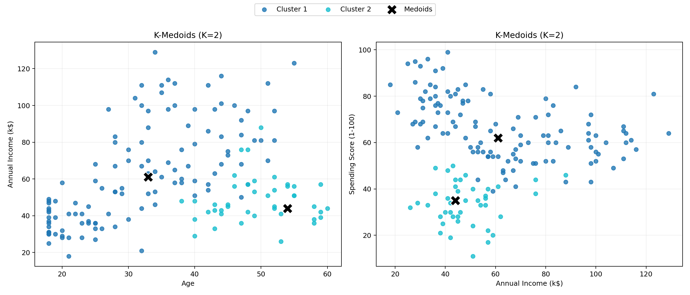
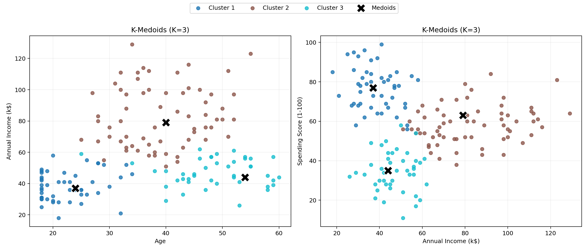
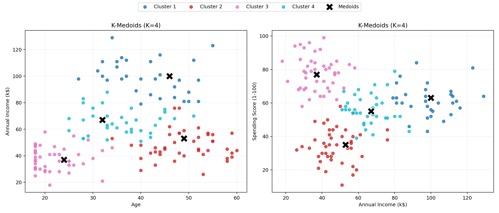
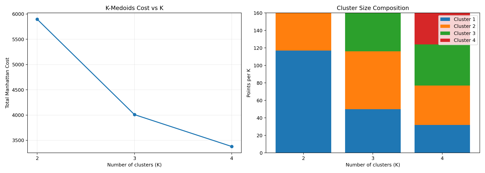

# K-Medoids Clustering on Synthetic Customer Segments

This project implements **K-Medoids clustering from scratch** (using Manhattan distance) on a synthetic but realistic customer dataset and visualizes the resulting clusters for:
- `K = 2`
- `K = 3`
- `K = 4`

Core files:
- `generate_dataset.py` (creates dataset)
- `K Medoid Clustering.py` (runs clustering + plots)

## What This Project Does

1. Loads customer data from `customer.txt` (tab-separated).
2. Encodes `Gender` (`Male -> 0`, `Female -> 1`).
3. Uses features:
   - `Age`
   - `Annual Income (k$)`
   - `Spending Score (1-100)`
4. Runs K-Medoids clustering for multiple values of K.
5. Prints for each K:
   - iteration count
   - total Manhattan cost
   - cluster sizes
   - medoid indices and medoid points
6. Saves visualizations in the `plots/` folder.
7. Creates a summary chart (`kmedoids_summary.png`) showing:
   - total cost vs K
   - cluster-size composition for each K

## Synthetic Dataset

This repository already includes a generated `customer.txt` dataset with **160 records**.

The data is generated from 4 customer behavior segments to make clustering meaningful:
- Young, lower-income, high-spending customers
- Mid-age, moderate-income, moderate-spending customers
- Older, lower-spending customers
- Affluent, selective-spending customers

You can regenerate the same dataset anytime (deterministic with seed `42`):

```bash
python generate_dataset.py
```

### Dataset Format

Expected columns:
- `Gender`
- `Age`
- `Annual Income (k$)`
- `Spending Score (1-100)`

Expected delimiter: **tab** (`\t`)

## Installation

Use Python 3.9+ (recommended).

Install dependencies:

```bash
pip install numpy pandas matplotlib
```

## How to Run

From this folder, run:

```bash
python generate_dataset.py
python "K Medoid Clustering.py"
```

To display saved plots in pop-up windows after generation:

```bash
python "K Medoid Clustering.py" --show
```

## Output

After execution, you should get:
- Console output for each `K` with medoid and cluster details.
- Saved plot images:
  - `plots/kmedoids_k2.png`
  - `plots/kmedoids_k3.png`
  - `plots/kmedoids_k4.png`
   - `plots/kmedoids_summary.png`

Each plot contains two views:
- `Age` vs `Annual Income (k$)`
- `Annual Income (k$)` vs `Spending Score (1-100)`

## Project Structure

```text
.
|-- generate_dataset.py
|-- K Medoid Clustering.py
|-- customer.txt            # synthetic dataset (included)
|-- plots/                  # auto-created after run
|-- README.md
```

## Sample Run Results

Observed on the included synthetic dataset:

- `K = 2`: cost `5896.00`, cluster sizes `[117, 43]`
- `K = 3`: cost `4009.00`, cluster sizes `[50, 66, 44]`
- `K = 4`: cost `3378.00`, cluster sizes `[32, 45, 47, 36]`

As expected, total Manhattan cost decreases as `K` increases.

## Visualization Preview

### K = 2



### K = 3



### K = 4



### Summary



## Notes

- The implementation uses a reproducible random seed (`random_state=42`).
- Empty-cluster cases are handled by reassigning a medoid candidate from non-medoid points.
- If `customer.txt` is not present, the script raises a clear `FileNotFoundError`.

## Future Improvements

- Add feature scaling before clustering.
- Add silhouette-score based selection of best K.
- Add 3D visualization for all three features.
